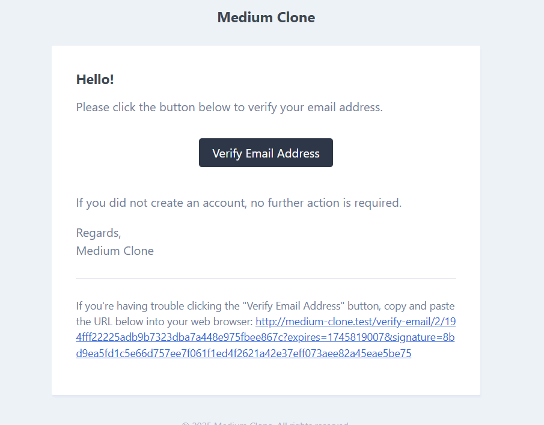

# Aprendendo Laravel

Este é um projeto simples, um "clone" baseado no site [Medium](https://medium.com/), implementado com Laravel.

## Funcionalidades Implementadas

### **Usuário**
- **Cadastro**: Permite que novos usuários se registrem na plataforma.
- **Login**: Sistema de autenticação para login de usuários.
- **Validação por E-mail**: Confirmação de conta via e-mail.
- **Perfil Público**: Exibição de perfil acessível por outros usuários.
- **Sistema de Seguir**: Usuários podem seguir outros autores.

### **Postagens**
- **Criação**: Autores podem criar novas postagens.
- **Curtir**: Usuários podem curtir as postagens.
- **Feed**: Exibe as postagens dos autores que o usuário segue na página inicial.
- **Filtro por Categoria**: Filtra postagens de acordo com a categoria selecionada.

## Aprendizado Adquirido

- **Estrutura de um projeto Laravel**: Compreensão da organização de pastas e arquivos no Laravel.
- **Criação de Models, Controllers e Migrations**: Implementação da lógica de negócio e interação com o banco de dados.
- **Configuração de Banco de Dados, Logs, Views, Storage e Rotas**: Configuração básica e aprimorada do projeto.
- **Uso do Tinker**: Exploração e manipulação de dados no banco de dados via terminal.
- **Validações de Requisição**: Implementação de regras para garantir a integridade e segurança dos dados.
- **Uso do [Eloquent](https://laravel.com/docs/12.x/eloquent)**: Utilização do ORM do Laravel para facilitar o acesso e manipulação de dados no banco.
- **Criação de Views com Componentes e Layouts**: Estruturação do front-end do site, incluindo a criação de layouts reutilizáveis.

## Algumas imagens

<figure>
  
  <figcaption>Esta é a legenda da imagem</figcaption>
</figure>

<figure>
  
  <figcaption>Esta é a legenda da imagem</figcaption>
</figure>

<figure>
  
  <figcaption>Esta é a legenda da imagem</figcaption>
</figure>

<figure>
  
  <figcaption>Esta é a legenda da imagem</figcaption>
</figure>

<figure>
  
  <figcaption>Esta é a legenda da imagem</figcaption>
</figure>

<figure>
  
  <figcaption>Esta é a legenda da imagem</figcaption>
</figure>

